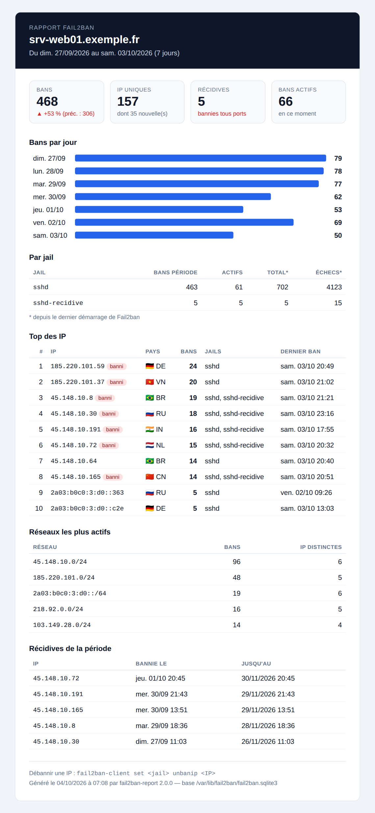

# Fail2ban Setup

Script d'installation et de configuration **multi-distribution** de Fail2ban, orienté
protection SSH, avec **rapport hebdomadaire des bans par email**.

```bash
sudo ./setup.sh            # interactif
sudo ./setup.sh --help     # toutes les options
```

## Fonctionnalités

- **Détection automatique** : distribution, init (systemd / OpenRC / SysV), pare-feu
  (firewalld, ufw, nftables, iptables), SELinux, service SSH (y compris `ssh.socket` d'Ubuntu ≥ 22.10).
- **Deux jails SSH** :

  | Jail             | Déclencheur                         | Sanction                         |
  |------------------|-------------------------------------|----------------------------------|
  | `sshd`           | 5 échecs en 1 h                     | ban **24 h** sur le(s) port(s) SSH |
  | `sshd-recidive`  | **3 bans `sshd`** en 30 jours       | ban **60 jours** sur **tous** les ports |

- **Changement assisté du port SSH** si sshd écoute sur le port 22 : SELinux (`semanage`),
  firewalld / ufw, socket systemd, validation `sshd -t`, **test de connexion obligatoire et
  retour arrière automatique** si la connexion n'est pas confirmée sous 5 minutes.
- **Rapport hebdomadaire HTML + texte** (timer systemd ou cron) : bans par jour, par jail,
  top des IP avec pays, réseaux /24 les plus actifs, récidives, comparaison avec la période
  précédente, alertes si une jail est tombée.
- **Email à chaque récidive** (en français, avec extrait whois).
- **Relais SMTP authentifié via Postfix** (Gmail, OVH, Office 365, Brevo…) avec email de test
  et contrôle de la file d'attente.
- **Robuste** : idempotent (relançable, réponses précédentes proposées par défaut), sauvegarde
  de chaque fichier modifié, journal complet, verrou anti-exécution concurrente, mode
  non interactif, compatible `curl … | sudo bash`, désinstallation propre.



## Distributions prises en charge

| Famille | Distributions | Paquets |
|---------|---------------|---------|
| Debian  | Debian, Ubuntu, Linux Mint, Raspberry Pi OS, Devuan | apt |
| Red Hat | RHEL, Rocky, AlmaLinux, CentOS Stream, Oracle Linux, Fedora, Amazon Linux 2 | dnf/yum + EPEL |
| SUSE    | openSUSE Leap / Tumbleweed, SLES | zypper |
| Arch    | Arch Linux, Manjaro, EndeavourOS | pacman |
| Alpine  | Alpine Linux (OpenRC) — installer bash d'abord : `apk add bash` | apk |

## Utilisation

### Interactif

```bash
git clone https://github.com/xavcrocfer/Fail2ban.git && cd Fail2ban
sudo ./setup.sh
```

Le script pose ses questions (port SSH, liste blanche, rapport, relais SMTP), affiche un
récapitulatif, puis applique la configuration après confirmation.

### Non interactif (Ansible, cloud-init…)

```bash
sudo SMTP_PASSWORD='mot-de-passe' ./setup.sh -y \
     --email admin@exemple.fr \
     --smtp-host smtp.exemple.fr --smtp-port 587 --smtp-user alertes@exemple.fr \
     --ignore-ip "203.0.113.10 198.51.100.0/24" \
     --ssh-port 49222
```

> En mode non interactif, le port SSH n'est modifié que si `--ssh-port` est fourni
> (aucun test de connexion possible : vérifiez immédiatement l'accès).

### Options

| Option | Rôle |
|--------|------|
| `-y`, `--non-interactive` | aucune question |
| `--ssh-port PORT` / `--keep-ssh-port` | déplacer SSH / ne jamais le proposer |
| `--ssh-mode MODE` | `normal` (défaut), `ddos`, `extra`, `aggressive` |
| `--ignore-ip "IP …"` | IP/CIDR jamais bannies |
| `--email`, `--from` | destinataire(s) / expéditeur |
| `--smtp-host`, `--smtp-port`, `--smtp-user` | relais Postfix (mot de passe : `SMTP_PASSWORD`) |
| `--report-day`, `--report-time` | planification (défaut : lundi 08:00) |
| `--no-report`, `--no-recidive-mail` | désactiver rapport / email de récidive |
| `--detect` | afficher la détection et quitter |
| `--uninstall` | supprimer la configuration installée |

Les seuils se règlent par variables d'environnement :
`SSH_MAXRETRY` (5), `SSH_FINDTIME` (1h), `SSH_BANTIME` (24h),
`RECIDIVE_MAXRETRY` (3), `RECIDIVE_FINDTIME` (30d), `RECIDIVE_BANTIME` (60d).

```bash
sudo SSH_MAXRETRY=3 RECIDIVE_BANTIME=90d ./setup.sh
```

## Fichiers installés

Le script ne modifie jamais `jail.conf` ni `jail.local` : il écrit ses propres fichiers,
régénérés à chaque exécution (personnalisations → `jail.d/99-local.local`).

| Fichier | Contenu |
|---------|---------|
| `/etc/fail2ban/fail2ban.d/00-fail2ban-setup.local` | log fichier + `dbpurgeage` (90 j) |
| `/etc/fail2ban/jail.d/00-fail2ban-setup-defaults.local` | liste blanche, action de ban, emails |
| `/etc/fail2ban/jail.d/10-fail2ban-setup-sshd.local` | jails `sshd` et `sshd-recidive` |
| `/etc/fail2ban/filter.d/sshd-recidive.conf` | filtre de récidive limité à la jail `sshd` |
| `/etc/fail2ban/action.d/mail-recidive.conf` | email de récidive |
| `/usr/local/sbin/fail2ban-recidive-restore` | restauration du compteur de récidive |
| `/etc/systemd/system/fail2ban.service.d/50-fail2ban-setup-recidive.conf` | lancement de la restauration au démarrage |
| `/usr/local/sbin/fail2ban-report` + `/etc/fail2ban/report.conf` | rapport hebdomadaire |
| `/etc/systemd/system/fail2ban-report.{service,timer}` (ou cron) | planification |
| `/etc/ssh/sshd_config.d/00-fail2ban-setup-port.conf` | port SSH (si modifié) |

Journal : `/var/log/fail2ban-setup.log` — sauvegardes : `/var/backups/fail2ban-setup/<date>/`.

## Détails techniques

- **Récidive** : `sshd-recidive` lit `/var/log/fail2ban.log` et compte les lignes
  `[sshd] Ban <IP>` (les `Restore Ban` du redémarrage sont ignorées). Le filtre `recidive`
  fourni avec Fail2ban compte les bans de *toutes* les jails ; celui-ci est restreint
  (`filter = sshd-recidive[_watched="sshd|nginx-.*"]` pour l'élargir).
- **Persistance des bans** : `dbpurgeage` passe de 1 jour (défaut) à 90 jours, sinon les bans
  de 60 jours ne seraient pas restaurés après un redémarrage.
- **Persistance du compteur de récidive** : Fail2ban garde les échecs en mémoire et reprend ses
  journaux là où il s'était arrêté ; sans précaution, un reboot entre deux bans « effacerait »
  les bans déjà comptés (limite de la jail `recidive` standard). `fail2ban-recidive-restore`,
  lancé par systemd après chaque démarrage (`ExecStartPost`), relit ces bans dans la base et
  les réinjecte (`fail2ban-client set sshd-recidive attempt`). Sans systemd (Alpine, Devuan),
  il est exécuté par le script d'installation ; après un redémarrage manuel :
  `fail2ban-recidive-restore`.
- **OpenSSH ≥ 9.8** journalise sous `sshd-session` : le filtre et le `journalmatch` sont
  élargis en conséquence (le filtre d'origine de Fail2ban 1.0 ne les détecte pas).
- **journald** est utilisé dès que possible (obligatoire sur Debian 12+ sans rsyslog).
- **Action de ban** : `firewallcmd-*` si firewalld est actif, sinon `nftables` (table dédiée
  qui coexiste avec ufw/iptables-nft), sinon `iptables`.

## Rapport hebdomadaire

```bash
fail2ban-report --stdout --until-now   # aperçu texte, inclut aujourd'hui
fail2ban-report --html /tmp/r.html     # version HTML
fail2ban-report --days 30 --to moi@exemple.fr
systemctl list-timers fail2ban-report  # prochaine exécution
```

Les données viennent de la base SQLite de Fail2ban (90 jours d'historique) et de
`fail2ban-client`. Le pays des IP est obtenu par `whois` (désactivable : `REPORT_GEOIP=no`).
Une IP débannie manuellement est retirée de la base par Fail2ban et n'apparaît donc plus
dans l'historique.

## Commandes utiles

```bash
fail2ban-client status sshd
fail2ban-client status sshd-recidive
fail2ban-client set sshd unbanip 1.2.3.4
fail2ban-client set sshd-recidive unbanip 1.2.3.4
fail2ban-regex /var/log/auth.log sshd    # tester un filtre
tail -f /var/log/fail2ban.log
```

## Dépannage

- **Emails non reçus** : `postqueue -p` affiche la raison du blocage ; beaucoup de relais
  exigent que l'expéditeur soit le compte authentifié (Gmail : mot de passe d'application).
- **Port SSH injoignable** : pensez au pare-feu de l'hébergeur (Security Group AWS/Azure/GCP,
  pare-feu réseau OVH, Scaleway, Hetzner…), le script ne gère que le pare-feu local.
- **Amazon Linux 2023** : pas d'EPEL officiel, Fail2ban peut y être indisponible.

## Désinstallation

```bash
sudo ./setup.sh --uninstall
```

Supprime les fichiers générés (le paquet Fail2ban sur demande). Le port SSH, Postfix et le
pare-feu ne sont pas modifiés.
